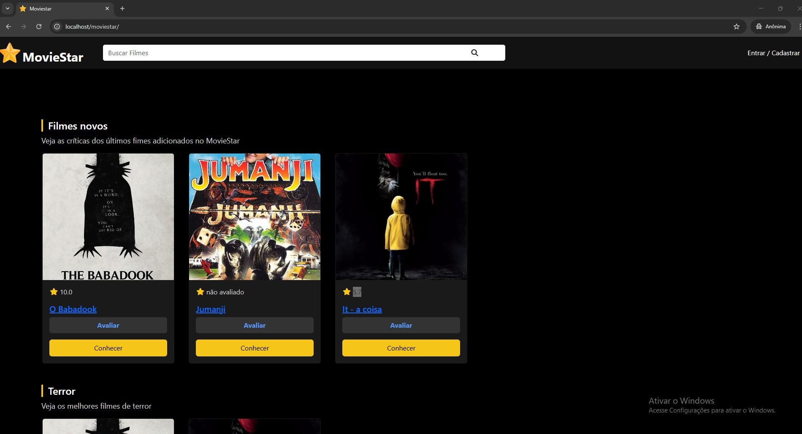
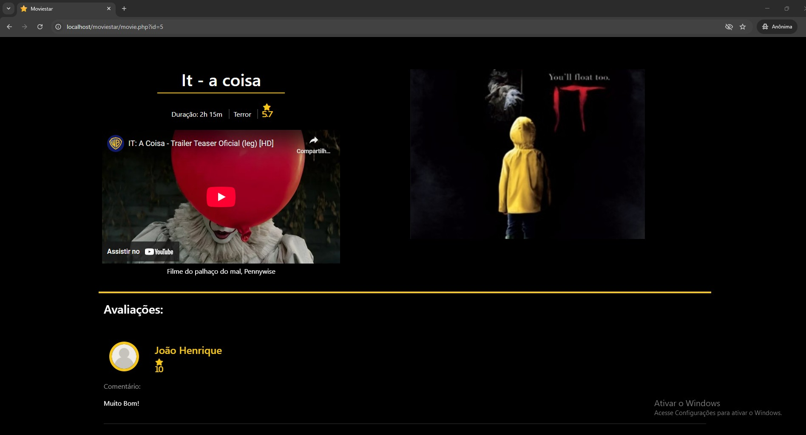
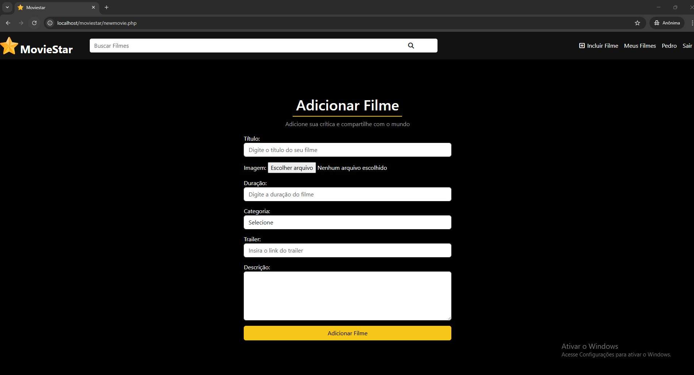

# MovieStar ⭐ 

## -> Home Page



## -> Sign up and Sign in


## -> Movies



## -> Profile


## -> Add Movies


> Context

A website where you can create your user and register films on the platform, as well as where you can review films already added by other people, and where you can also give your rating to the posted film.


## Technologies
- PHP
- HTML5
- CSS3
- MySQL
- Git e Github

## Installation

1. Clone the repository into your htdocs:
```bash
git clone https://github.com/Rafael19722/MovieStar.git
```
2. Start your Apache and MySQL through XAMPP and open the cloned repository folder
